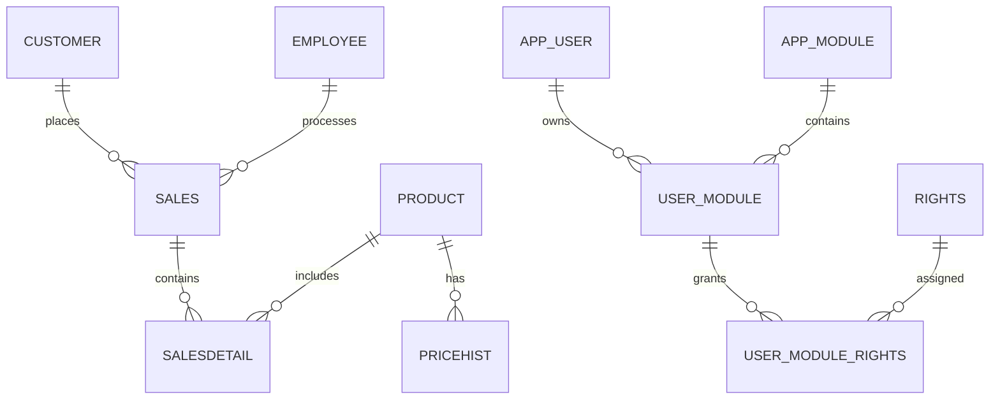

# Sales Management System ERD

This ERD documents the main database entities for the Sales Management System project.

## Tables

- `customer` stores customer profiles.
- `employee` stores sales and operations staff.
- `product` stores catalog items.
- `pricehist` stores historical pricing for products.
- `sales` stores top-level sales records.
- `salesdetail` stores line-items for each sale.
- `app_user` stores application users for rights management.
- `app_module` stores module definitions.
- `user_module` connects users to modules.
- `rights` stores permission codes.
- `user_module_rights` assigns rights to user-module relationships.

## Key relationships

- `sales.customer_id` → `customer.id`
- `sales.employee_id` → `employee.id`
- `salesdetail.sales_id` → `sales.id`
- `salesdetail.product_id` → `product.id`
- `pricehist.product_id` → `product.id`
- `user_module.user_id` → `app_user.id`
- `user_module.module_id` → `app_module.id`
- `user_module_rights.user_module_id` → `user_module.id`
- `user_module_rights.rights_id` → `rights.id`

## Notes

- `sales` and `salesdetail` include `record_status` and `stamp` columns.
- `customer`, `employee`, `product`, and `pricehist` are intentionally unchanged with no record-status fields.

